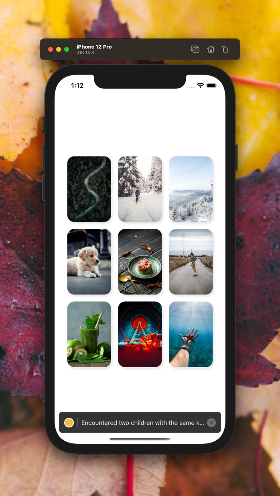

[](https://github.com/WrathChaos/react-native-gallery)

[](https://github.com/WrathChaos/react-native-gallery)

[](https://www.npmjs.com/package/@paraboly/react-native-gallery)
[](https://www.npmjs.com/package/@paraboly/react-native-gallery)

[](https://opensource.org/licenses/MIT)
[](https://github.com/prettier/prettier)

<p align="center">
  
  
</p>

# Installation

Add the dependency:

```bash
npm i @paraboly/react-native-gallery
```

## Peer Dependencies

<h5><i>IMPORTANT! You need install them</i></h5>

```js
"@freakycoder/react-native-bounceable": "^0.2.4",
"@freakycoder/react-native-progressive-fast-image": "^0.2.2",
"react-native-easy-state-view": "^1.0.0",
"react-native-fast-image": "^8.3.4",
"react-native-spinkit": "^1.5.1"
```

# Usage

## Import

```jsx
import ImageGallery from "@paraboly/react-native-gallery";
```

## Fundamental Usage

```jsx
<ImageGallery
  data={galleryData}
  loadingSource={require("./assets/spinner.gif")}
  onPress={(itemIndex: number) => console.log("Item Index: ", itemIndex)}
/>
```

## Data Format

You should use this `source` data object format.

```javascript
[
  {
    source: { uri: "" },
  },
  {
    source: require("../path"),
  },
];
```

### <i>Example Array </i>

```json
[
  {
    "source": {
      "uri": "https://images.unsplash.com/photo-1610960245237-cfab0dea6be4?ixid=MXwxMjA3fDB8MHxwaG90by1wYWdlfHx8fGVufDB8fHw%3D&ixlib=rb-1.2.1&auto=format&fit=crop&w=700&q=80"
    }
  },
  {
    "source": {
      "uri": "https://images.unsplash.com/photo-1611058619873-cbc8123debb3?ixid=MXwxMjA3fDB8MHxwaG90by1wYWdlfHx8fGVufDB8fHw%3D&ixlib=rb-1.2.1&auto=format&fit=crop&w=630&q=80"
    }
  },
  {
    "source": {
      "uri": "https://images.unsplash.com/photo-1611056162989-bcfcdefaae14?ixid=MXwxMjA3fDB8MHxwaG90by1wYWdlfHx8fGVufDB8fHw%3D&ixlib=rb-1.2.1&auto=format&fit=crop&w=1050&q=80"
    }
  },
  {
    "source": {
      "uri": "https://images.unsplash.com/photo-1611003229244-fa443d2a2a96?ixid=MXwxMjA3fDB8MHxwaG90by1wYWdlfHx8fGVufDB8fHw%3D&ixlib=rb-1.2.1&auto=format&fit=crop&w=967&q=80"
    }
  },
  {
    "source": {
      "uri": "https://images.unsplash.com/photo-1611001395253-b721fcff3666?ixid=MXwxMjA3fDB8MHxwaG90by1wYWdlfHx8fGVufDB8fHw%3D&ixlib=rb-1.2.1&auto=format&fit=crop&w=634&q=80"
    }
  },
  {
    "source": {
      "uri": "https://images.unsplash.com/photo-1610981056460-c5c72ce4c8d0?ixid=MXwxMjA3fDB8MHxwaG90by1wYWdlfHx8fGVufDB8fHw%3D&ixlib=rb-1.2.1&auto=format&fit=crop&w=634&q=80"
    }
  },
  {
    "source": {
      "uri": "https://images.unsplash.com/photo-1610970881699-44a5587cabec?ixid=MXwxMjA3fDB8MHxwaG90by1wYWdlfHx8fGVufDB8fHw%3D&ixlib=rb-1.2.1&auto=format&fit=crop&w=634&q=80"
    }
  },
  {
    "source": {
      "uri": "https://images.unsplash.com/photo-1610659606489-77967e40fa35?ixid=MXwxMjA3fDB8MHxwaG90by1wYWdlfHx8fGVufDB8fHw%3D&ixlib=rb-1.2.1&auto=format&fit=crop&w=634&q=80"
    }
  },
  {
    "source": {
      "uri": "https://images.unsplash.com/photo-1610981263015-ef95481e9ffb?ixid=MXwxMjA3fDB8MHxwaG90by1wYWdlfHx8fGVufDB8fHw%3D&ixlib=rb-1.2.1&auto=format&fit=crop&w=675&q=80"
    }
  },

  {
    "source": {
      "uri": "https://images.unsplash.com/photo-1610987653945-fe23ff170a2f?ixid=MXwxMjA3fDB8MHxwaG90by1wYWdlfHx8fGVufDB8fHw%3D&ixlib=rb-1.2.1&auto=format&fit=crop&w=634&q=80"
    }
  },
  {
    "source": {
      "uri": "https://images.unsplash.com/photo-1610982408056-0cf21c1edb64?ixid=MXwxMjA3fDB8MHxwaG90by1wYWdlfHx8fGVufDB8fHw%3D&ixlib=rb-1.2.1&auto=format&fit=crop&w=1050&q=80"
    }
  },
  {
    "source": {
      "uri": "https://images.unsplash.com/photo-1610985738484-a3d5393a8a79?ixid=MXwxMjA3fDB8MHxwaG90by1wYWdlfHx8fGVufDB8fHw%3D&ixlib=rb-1.2.1&auto=format&fit=crop&w=675&q=80"
    }
  }
]
```

## Example Project 😍

You can checkout the example project 🥰

Simply run

- `npm i`
- `npx pod-install` (iOS Only)
- `react-native run-ios/android`

should work of the example project.

# Configuration - Props

## Fundamentals

| Property |       Type        |  Default  | Description              |
| -------- | :---------------: | :-------: | ------------------------ |
| data     | Array<IImageData> | undefined | set the image array data |

## Customization (Optionals)

| Property                  |   Type    |  Default  | Description                                                             |
| ------------------------- | :-------: | :-------: | ----------------------------------------------------------------------- |
| onPress                   | function  | undefined | set your own logic for the button functionality when it is pressed      |
| style                     | ViewStyle |  default  | set or override the style object for the main container                 |
| listStyle                 | ViewStyle |  default  | set or override the style object for the FlatList style                 |
| listContentContainerStyle | ViewStyle |  default  | set or override the style object for the FlatList contentContainerStyle |
| defaultImageSource        |   image   |  default  | change the default image source                                         |
| emptyStateImageSource     |   image   |  default  | change the empty state image source                                     |

## Future Plans

- [x] ~~LICENSE~~
- [ ] Write an article about the lib on Medium

## Author

FreakyCoder, kurayogun@gmail.com

## License

React Native Gallery is available under the MIT license. See the LICENSE file for more info.
